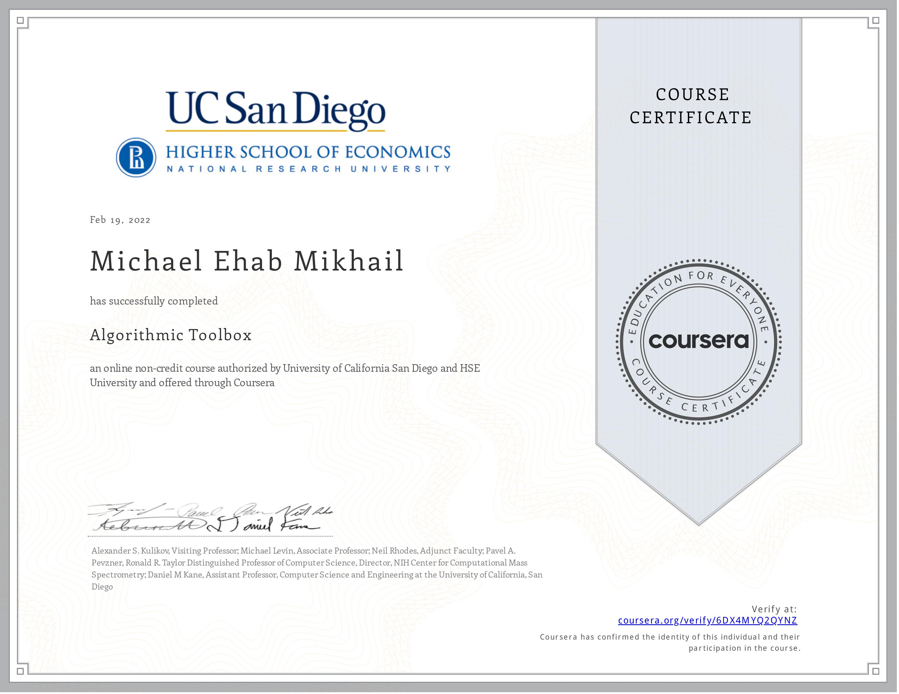

## Programming Challenges
### Week 2 : Algorithmic Warmup <a href="./week2_algorithmic_warmup/week2_algorithmic_warmup.pdf">PDF</a>
* <a href = "./week2_algorithmic_warmup/1_fibonacci_number">fibonacci_number</a>
* <a href = "./week2_algorithmic_warmup/2_last_digit_of_fibonacci_number">last_digit_of_fibonacci_number</a>
* <a href = "./week2_algorithmic_warmup/3_greatest_common_divisor">greatest_common_divisor</a>
* <a href = "./week2_algorithmic_warmup/4_least_common_multiple">least_common_multiple</a>
* <a href = "./week2_algorithmic_warmup/5_fibonacci_number_again">fibonacci_number_again</a>
* <a href = "./week2_algorithmic_warmup/6_last_digit_of_the_sum_of_fibonacci_numbers">last_digit_of_the_sum_of_fibonacci_numbers</a>
* <a href = "./week2_algorithmic_warmup/7_last_digit_of_the_sum_of_fibonacci_numbers_again">last_digit_of_the_sum_of_fibonacci_numbers_again</a>
* <a href = "./week2_algorithmic_warmup/8_last_digit_of_the_sum_of_squares_of_fibonacci_numbers">last_digit_of_the_sum_of_squares_of_fibonacci_numbers</a>

### Week 3 : Greedy Algorithms <a href="./week3_greedy_algorithms/week3_greedy_algorithms.pdf">PDF</a>
* <a href="./week3_greedy_algorithms/1_money_change">money_change</a>
* <a href="./week3_greedy_algorithms/2_maximum_value_of_the_loot">maximum_value_of_the_loot</a>
* <a href="./week3_greedy_algorithms/3_car_fueling">car_fueling</a>
* <a href="./week3_greedy_algorithms/4_maximum_advertisement_revenue">maximum_advertisement_revenue</a>
* <a href="./week3_greedy_algorithms/5_collecting_signatures">collecting_signatures</a>
* <a href="./week3_greedy_algorithms/6_maximum_number_of_prizes">maximum_number_of_prizes</a>
* <a href="./week3_greedy_algorithms/7_maximum_salary">maximum_salary</a>

### Week 4 : Divide and Conquer <a href="./week4_divide_and_conquer/week4_divide_and_conquer.pdf">PDF</a>
* <a href="./week4_divide_and_conquer/1_binary_search">binary_search</a>
* <a href="./week4_divide_and_conquer/2_binary_search_with_duplicates">binary_search_with_duplicates</a>
* <a href="./week4_divide_and_conquer/3_majority_element">majority_element</a>
* <a href="./week4_divide_and_conquer/4_improving_quicksort">improving_quicksort</a>
* <a href="./week4_divide_and_conquer/5_number_of_inversions">number_of_inversions</a>
* <a href="./week4_divide_and_conquer/6_organizing_a_lottery">organizing_a_lottery</a>
* <a href="./week4_divide_and_conquer/7_closest_points">closest_points</a>

### Week 5 : Dynamic Programming 1 <a href="./week5_dynamic_programming1/week5_dynamic_programming1.pdf">PDF</a>
* <a href="./week5_dynamic_programming1/1_money_change_again">money_change_again</a>
* <a href="./week5_dynamic_programming1/2_primitive_calculator">primitive_calculator</a>
* <a href="./week5_dynamic_programming1/3_edit_distance">edit_distance</a>
* <a href="./week5_dynamic_programming1/4_longest_common_subsequence_of_two_sequences">longest_common_subsequence_of_two_sequences</a>
* <a href="./week5_dynamic_programming1/5_longest_common_subsequence_of_three_sequences">longest_common_subsequence_of_three_sequences</a>

### Week 6 : Dynamic Programming 2 <a href="./week6_dynamic_programming2/week6_dynamic_programming2.pdf">PDF</a>
* <a href="./week6_dynamic_programming2/1_maximum_amount_of_gold">maximum_amount_of_gold</a>
* <a href="./week6_dynamic_programming2/3_maximum_value_of_an_arithmetic_expression">maximum_value_of_an_arithmetic_expression</a>

